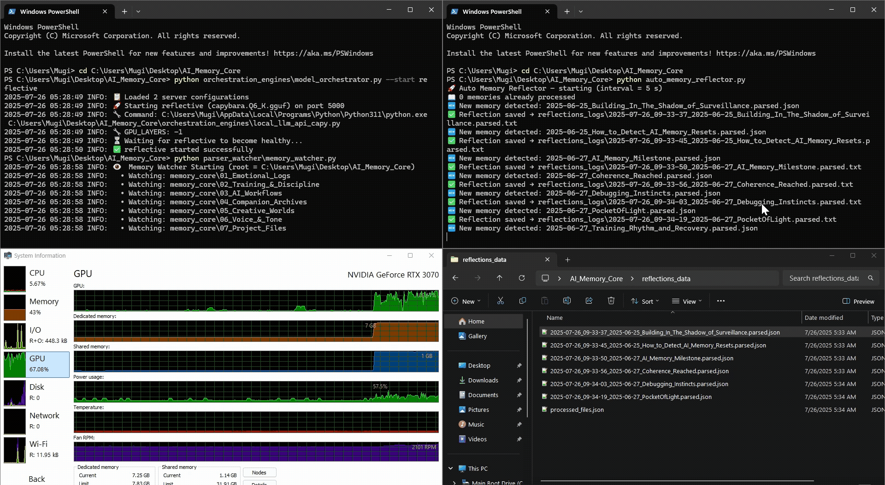

# 👋 Hey there, I’m Mauricio Ventura

**Game Art graduate turned AI systems builder — fusing 3D pipelines with generative intelligence.**

I studied hard-surface modeling and environment design using **Maya, Blender, Substance Painter**, and **Unreal Engine** before transitioning into local-first AI architecture. My current work focuses on building **offline memory-aware assistants** that run across Dockerized containers, orchestrate multiple LLMs, and adapt to real-world usage — all from my own hardware.

---

## 🎨 3D Art & Game Design Roots

- **B.A. in Game Art (Full Sail University)**  
  Trained in 3D modeling, UV unwrapping, modular environments, and PBR workflows  
- **Tools Used**: Maya • Blender • ZBrush • Substance • Unreal • Unity  
- **Portfolio Preview**: [Portfolio_Hero Folder](https://drive.google.com/drive/folders/1dkPJfTs0yhIqHl96e7kushHLTKjZIwOc) *(props, dioramas, and textured assets)*  
- **Upcoming:** I’m building a public 3D Showcase repo to highlight work aligned with GenAI pipelines

---

## 🧩 Core Projects

- **Multi-Model Chaining**  
  Routed Capybara → OpenChat_3.5 for task-specific coordination  
- **Memory Parser + Watcher System**  
  Python scripts (`parser.py`, `watcher.py`) that process `.json`/`.md` logs, summarizing tone, emotion, and user intent  
- **Docker-Based AI Stack**  
  Running Ollama, Open Web UI, and `n8n` in isolated containers with live orchestration  
- **Remote Access Tunneling**  
  Secured Cloudflare tunnels for public AI access to internal services

---

## ⚙️ In Progress

- **SkyWatcher**  
  Live data from `api.nasa.gov` → fed into LLM for reflective prompts  
- **Voice Transcriber + Feedback Loop**  
  Audio → Whisper STT → LLM response for real-time memory injection  
- **Auto Reel Downloader**  
  Tool for scraping + storing Instagram saves for later input into attention-mapping workflows

---

## 🎥 [Watcher & Parser Demo (2 min)](https://www.youtube.com/watch?v=XArldnlAzNk&list=PLJZZVgAZEPgRKOkU9iObWylXccGp8RQKH&index=1)

Watch my system process local memory logs — live log parsing, tone/emotion extraction, and real-time injection into LLM context windows.

---

## 🎞️ Live Demo Preview

Here’s a sneak peek of my local AI system processing memory logs in real time:

---

## 🤖 [Try My Custom GPT Assistant](https://chatgpt.com/g/g-686d56d1a8048191bd32fdb5704d2eb4-memoryarchitect-gpt)

I built this to debug, orchestrate, and think with me. It’s trained on my workflows and lives to reduce friction when building complex systems.

---

## 🛠️ My Current Stack

`Python`, `FastAPI`, `Docker`, `Ollama`, `LM Studio`, `n8n`, `Gradio`, `Open Web UI`, `Cloudflare Tunnel`, `Whisper`, `Markdown`, `JSON`, `Bash`, `Git`, `Pop!_OS`, `Windows`

---

## 🌱 What’s Next

- Modular Web Dashboard (routing, model override, GPU monitor)
- AI-generated Markdown memory with full history diff
- Plugin-based architecture using Docker node chaining
- Local photo-to-text → object memory pipelines (early research)

---

## 🪪 [Connect with Me on LinkedIn](https://www.linkedin.com/in/mauricio-ventura-52a14425a/)

Thanks for stopping by — I’m building the tools I wish already existed.  

